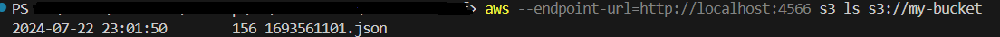

# Localstack-TF

This repo's purpose is to store the Terraform infrastructure used in the assignment.
This repo will also contain the docker-compose.yaml file used to set up the three containers: the localstack, the publisher and the puller.

"microservice1" will be referred to here as "publisher1", "microservice2" will be referred to here as "puller2"

## Prerequisites

Before you begin, ensure you have the following installed on your local machine:

- Docker
- Docker Compose
- AWS CLI
- Terraform
- LocalStack
- awscli-local (you can simply run "pip install awscli-local")
- terraform-local (you can simply run "pip install terraform-local")

## Setup Instructions

### 1. Clone the Repository

```sh
git clone https://github.com/swiphf/localstack-tf.git
cd localstack-tf
```

### 2. Run the containers

```sh
docker network create localstack-network 
docker-compose pull
docker-compose up -d
```

### 3. Create the S3 and SQS

```
tflocal init
tflocal apply
```

### 4. Use Postman to test the application 
In this step you should use postman (or any other tool of your choice) and send a POST request to the publisher1 service.
The request should contain the following json body:
```
{
 "data": {
 "email_subject" : "Happy new year!",
 "email_sender" : "John doe",
 "email_timestream": "1693561101",
 "email_content": "Just want to say... Happy new year!!!"
 },
 "token" : "$DJISA<$#45ex3RtYr"
}
```

### 5. Validate the target S3
Now, (after a minimum of 10 seconds) you should check the S3 bucket to see if there is a new file corresponding your "timestream" field in the json.

Success example:


---

## Commands that you might want to use:
Empty an s3 bucket:
```
aws --endpoint-url=http://localhost:4566 s3 rm s3://my-bucket --recursive
```
Purge sqs queue:
```
aws --endpoint-url=http://localhost:4566 sqs purge-queue --queue-url http://localhost:4566/000000000000/my-queue
```
List an s3 bucket:
```
aws --endpoint-url=http://localhost:4566 s3 ls s3://my-bucket
```
